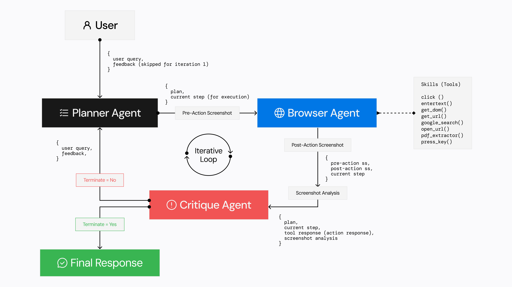

# Agentic Browser

## Table of Contents

- [Overview](#overview)
- [Features](#features)
- [Architecture](#architecture)
- [Agents Workflow](#agents-workflow)
- [Quick Start](#quick-start)
- [License](#license)
- [Acknowledgements](#acknowledgements)

## Overview

Agentic Browser is an agent-based system designed to automate browser interactions using a natural language interface. Built upon the [PydanticAI Python agent framework](https://github.com/pydantic/pydantic-ai), Agentic Browser allows users to automate tasks such as form filling, product searches on e-commerce platforms, content retrieval, media interaction, and project management on various platforms. 

## Features

### Browser Automation

- **Web Research and Analysis**: Intelligent web research across academic papers, travel sites & code repositories with natural language queries.
- **Data Extraction**: Extracts and compiles data of various types such as sports data, historical data, stock market and currencies.
- **E-commerce Information**: Scrapes information like price, specifications, availaibility of a product on various e-commerce websites.
- **Web Traversal**: Smart cross-domain navigation with context-aware website traversal & data correlation.

## Architecture



Agentic Browser uses three specialized agents working in harmony:

- **Planner Agent**: The strategist that breaks down user requests into clear, executable steps. It creates and adapts plans based on feedback and progress.

- **Browser Agent**: The executor that directly interacts with web pages. It performs actions like clicking, typing, navigating, and extracting information using browser automation tools.

- **Critique Agent**: The quality controller that analyzes actions, verifies results, and guides the workflow. It determines if tasks are complete or need refinement.

The agents work in a feedback loop to ensure that actions are taken correctly and tasks are completed effectively.

## Agents Workflow

### Step 1: Planning Phase

- The **Planner Agent** receives a user request
- Analyzes the task requirements
- Creates a step-by-step execution plan
- Determines the first action to take

### Step 2: Execution Phase

- The **Browser Agent** receives the current step
- Executes precise browser actions (navigation, clicks, text entry)
- Uses tools like DOM inspection and screenshot analysis
- Reports action results

### Step 3: Evaluation Phase

- The **Critique Agent** reviews the execution
- Analyzes screenshots and DOM changes
- Verifies if the step was successful
- Decides whether to:
  - Complete the task and return results to user
  - Continue to next step in plan
  - Request plan modification from Planner Agent

This cycle continues until the task is successfully completed or a terminal condition is reached.

## Quick Start

### Setup

To get started with Agentic Browser, follow the steps below to install dependencies and configure your environment.

#### 1. Install `uv`

Agentic Browser uses `uv` to manage the Python virtual environment and package dependencies.

- macOS/Linux:

  ```bash
  curl -LsSf https://astral.sh/uv/install.sh | sh
  ```

- Windows:

  ```bash
  powershell -c "irm https://astral.sh/uv/install.ps1 | iex"
  ```

  You can install uv using pip

#### 2. Clone the repository:

    git clone https://github.com/TheAgenticAI/TheAgenticBrowser
    
#### 3. Set up the virtual environment

Use uv to create and activate a virtual environment for the project.

    uv venv --python=3.11
    source .venv/bin/activate
    # On Windows: .venv\Scripts\activate

#### 4. Install dependencies

    uv pip install -r requirements.txt

#### 5. Install Playwright Drivers

    playwright install

If you want to use your local Chrome browser over Playwright, go to chrome://version/ in Chrome, find the path to your profile, and set BROWSER_STORAGE_DIR to that path in .env

#### 6. Configure the environment

Create a .env file by copying the provided example file.

    cp .env.example .env

Edit the .env file and set the following variables:

    # AGENTIC_BROWSER Configuration
    AGENTIC_BROWSER_TEXT_MODEL=<text model name eg. "gpt-4o">
    AGENTIC_BROWSER_TEXT_API_KEY=<your text model API key>
    AGENTIC_BROWSER_TEXT_BASE_URL=<text model base url eg. "https://api.openai.com/v1">
    
    # Screenshot Analysis Configuration
    AGENTIC_BROWSER_SS_ENABLED=<true/false>
    AGENTIC_BROWSER_SS_MODEL=<screenshot model name eg. "gpt-4o">
    AGENTIC_BROWSER_SS_API_KEY=<your screenshot model API key>
    AGENTIC_BROWSER_SS_BASE_URL=<screenshot model base url eg. "https://api.openai.com/v1">

    # Logging
    LOGFIRE_TOKEN=<your logfire write token>
    
    # Google Search Configuration
    GOOGLE_API_KEY=<your Custom Search json api>
    GOOGLE_CX=<your google custom search engine id>
    
    # Browser Configuration
    BROWSER_STORAGE_DIR=<path to browser storage directory eg. "./browser_storage">
    STEEL_DEV_API_KEY=<Optional: Enable remote browser via Steel Dev CDP, (Only useful when launched as an API, see Step 7>

#### 7. Running the project

You can directly run the project from the main.py file or even spin up a server to interact through an API

- Direct
  ```bash
  python3 -m core.main
  ```
- API

  ```bash
  uvicorn core.server.api_routes:app --loop asyncio
  ```

  Details -

  ```
  POST http://127.0.0.1:8000/execute_task

  {
      "command": "Give me the price of RTX 3060ti on amazon.in and give me the latest delivery date."
  }
  ```

### Running API with Docker (for AgenticBench)

#### For Ubuntu/Windows :

```bash

docker build -t agentic_browser .
docker run -it --net=host --env-file .env agentic_browser

```

#### For macOS :

```bash

docker build -t agentic_browser .
docker run -it -p 8000:8000 --env-file .env agentic_browser

```

## Acknowledgements

- [Agent-E](https://github.com/EmergenceAI/Agent-E?tab=readme-ov-file)
- [PydanticAI Python Agent Framework](https://github.com/pydantic/pydantic-ai)
